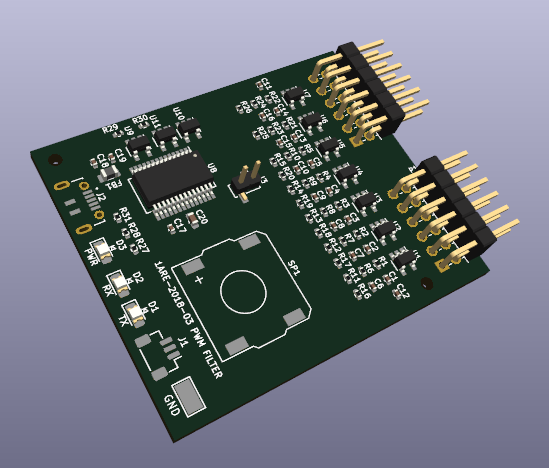

# Overview

This circuit is a PWM audio filter for the TT04 ChipTune project.
ChipTune replicates the Audio Processing Unit (APU) of vintage video games.
Separate PWM outputs are provided for each sound engine, allowing NES game music to be externally mixed into stereo or surround sound.
Resistor values will be tailored for balancing channel volume.

The primary interface is PMOD connectors to the TT04 Breakout Board. Final layout is pending assignment of all three PMOD connectors.

Based on data from:
- https://github.com/WallieEverest/tt04

## Interface

- UI_IN PMOD
- UO_OUT PMOD
- UIO PMOD (unused)
- USB-B for serial UART control of the Tiny Tapeout project
- JST 3-pin connector for low-level stereo preamp
- Onboard speaker for demonstrations
